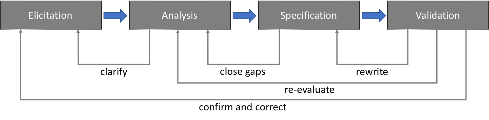

# Assignment #1

This assignment is due in my inbox by the end of class (20:05) on 17 October. You may use any materials that make sense to you, but I ask that you provide links to references you use from the web.

## Overview

We discussed four possible phases in a possible requirements development process. Clearly the process involves some level of iteration over the various phases, and we've shown those in class.

Are there other processes that could be used for the requirements development process? If so, what would those processes look like? Would they be iterative as well?

If you are of the opinion that this is a reasonable, useful, and defensible process, what changes might you make to close any gaps?

Finally, discuss the timeframe in which your chosen process operates and why it operates that way.
